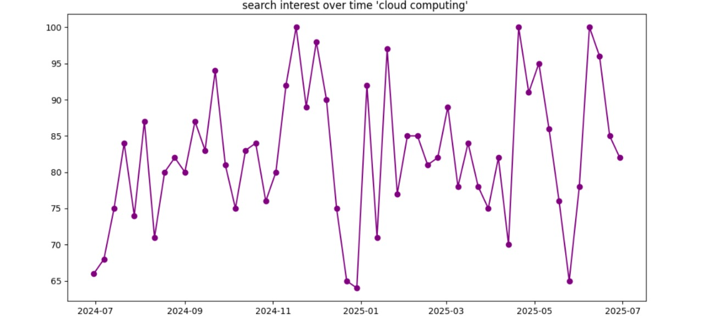

# TrendMining_GoogleSearch_PyTrends_Based_Analytics
This project uses Python-based data analysis using the Google Trends API (PyTrends) to investigate regional and worldwide search trends.
Absolutely, Deemis! Here's a complete, professional-style `README.md` structure for your project **`TrendMining_GoogleSearch_PyTrends_Based_Analytics`** — tailored to showcase your skills and impress recruiters, contributors, and the community.

---

## 🧠 Project Title

**TrendMining: Google Search PyTrends-Based Analytics**

---

## 📌 Description

This project uncovers global and regional search interest using Google Trends data through the unofficial **PyTrends API**. It enables users to explore **what the world is searching for**, how trends evolve over time, and how search behavior varies across **countries** and **Google platforms** like **YouTube**, **News**, and **Web Search**.

By leveraging **Python**, **data visualization**, and **geospatial mapping**, this project brings search trend data to life in an interpretable and visually compelling format.

---

## 🎯 Objective

To mine, analyze, and visualize search patterns for selected keywords across the globe, helping decode audience intent and interest using publicly available Google Trends data.

---

## 🔧 Tools & Technologies

* 🐍 **Python**
* 🧪 **Pandas**, **NumPy** – for data processing
* 📊 **Seaborn**, **Matplotlib**, **Plotly** – for visualizations
* 🌐 **PyTrends** – Google Trends data extraction
* 🌍 **Plotly Choropleth Maps** – for geospatial search mapping

---

## 🔍 Key Features

* Extracted real-time and historical trend data for one or multiple keywords.
* Created dynamic visualizations to compare search interest across countries.
* Segmented data by Google property (e.g., Web, YouTube, News).
* Time-series plots showing rising and falling interest over months or years.
* Regional analysis using interactive maps and bar charts.

---

## 📈 Insights Uncovered

* Which countries show the **highest interest** for a topic.
* How **platform-based trends** (e.g., YouTube vs Web Search) vary.
* Trend evolution across time using **line graphs**.
* Potential **seasonal patterns** or spikes in public interest.

